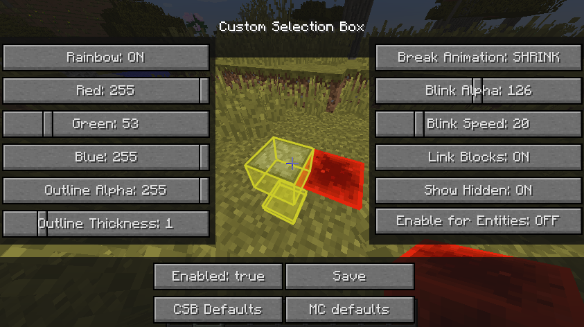

# Custom Selection Box

Fork from [shedaniel's fork](https://github.com/shedaniel/CustomSelectionBox-New)
of [tennox's original mod](https://gitlab.com/tennox-mods/CustomSelectionBox)

(Back)Port to [Ornithe](https://ornithemc.net/) 1.12.
Open settings with `/csbconfig` or [modmenu](https://modrinth.com/mod/modmenu-ornithe).

- `Shrink`, `Down`, `Alpha` break animations.
  - Enable `Show Hidden` for `Shrink` to disable depth test.
- `Enable for Entities`: renders entity hitbox and glowing outline when it is targeted.
- Renders selection box underwater.
- `Link Blocks` combines the hitbox for flowers, doors, beds, and pistons.

